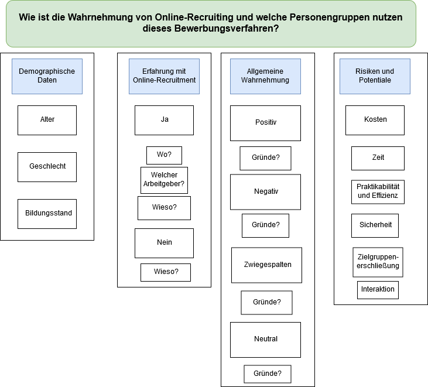
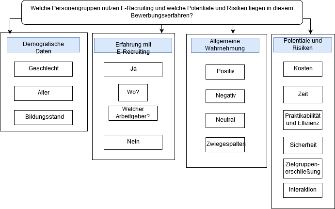

# E-RecruitingWS1920

## Gruppenmitglieder: 
* Anika Berghahn 
* Ivana Markovic 
* Christina Koerfers 
* Pia Nolte  

## Forschungsfrage: 
_Wie wird Online-Recruiting wahrgenommen und welche Personengruppen nutzen dieses Bewerbungsverfahren?_ 

# Zu replizierendes Ergebnis: 
_Wahrnehmung_: 
* überwiegend positiv bei einer jungen, gut gebildeten Personengruppe
* kritisch bei älteren Personengruppen 

_Nutzung_: 
* eher jüngere Generation 

_eigener Akzent (zusätzlich, nicht im Fokus)_:
* Ob es in gewissen Branchen überhaupt E-Recruiting gibt? Besteht dort überhaupt Interesse und Bedarf? 

# _Neuere Version_:

# _Ältere Version_:

 

